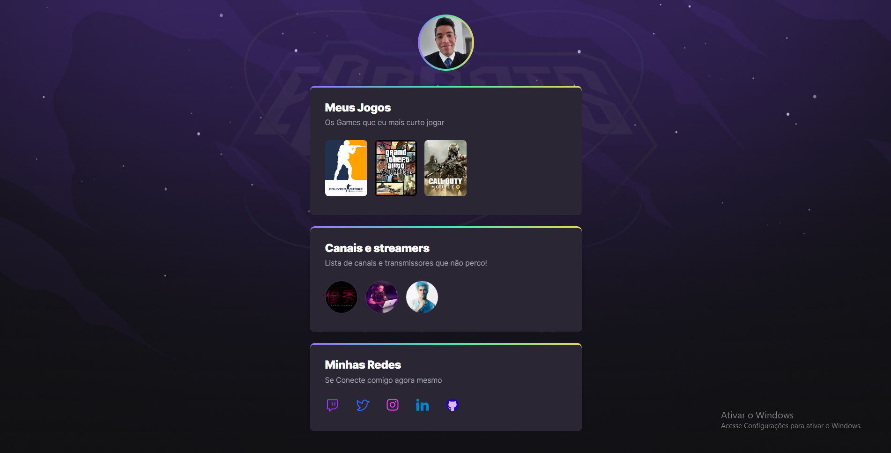

# NLW  eSports 

> Trilha Explorer 

Projeto construido do evento Next Level Week da Rocketseat.

👉🏼[Clique aqui para accessar](https://eclectic-gumdrop-d4b01a.netlify.app/)

👉🏼[Link de netlify](https://jose26362780.github.io/nlw-esports-explorer/)

##   🔧 Tecnologias

- Html 
- Css
- Git e Github

## O que aprendi Nessa edição da NLW 

 Nesta edição aprendi mexer um pouco mais para mexer na ferramenta de git e github fazer o upload do projeto apartir do vscode, assim como o uso de algumas propriedades de css para colocar as bordas e varios outros conceitos.

## Contato 💻💻

juniorjose1925@gmail.com
